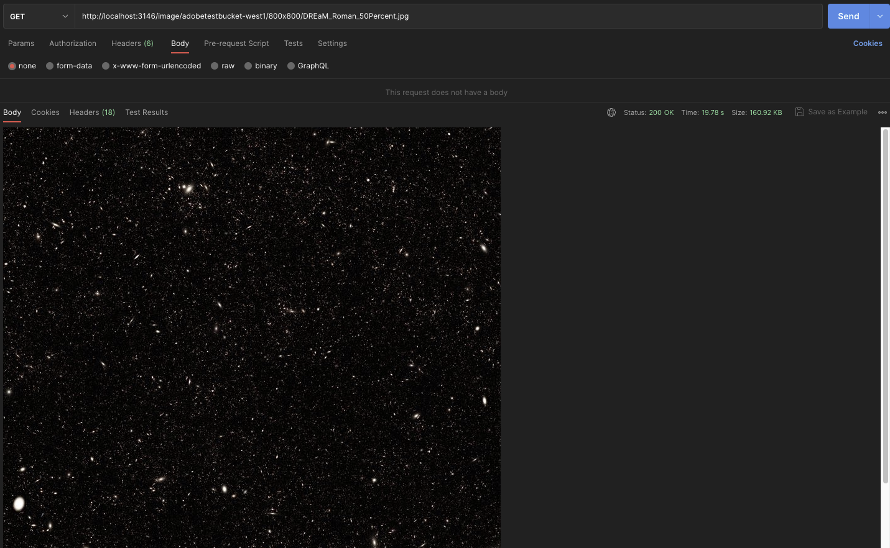

# Dyamic Image Handler PoC

## About

This is a PoC created to support dynamic image rendition with an image resize support. Additional features can be added as required in the future. This is developed based on the Sharp opensource framework. This application can be used as a standalone NodeJS app running in EC2 or containerize it.

## Architecture


## Input / Output

Request:
Access the DIH with below URI path:

http://{{host}}:{{port}}/image/:bucket/:edits/:key

> bucket - Source S3 bucket where the image is stored
> edits - {{width}}x{{height}} - Expected resize image size
> key - Image name with extension

Sample request:
http://localhost:3146/image/source-bucket/800x800/sample1.jpg

Response:
Modified image response



## Install Prerequisites

- Git
- Node JS v14 or above
- npm v6 or above
- Create an IAM Role with access to the source and destination S3 buckets. Attach that role to the user used to access S3 from local

## App Build

### Local setup

Clone the source code  
From the source root directory, run the below commands

Install the dependencies

```
npm install
```

Setup ESLint

```
npm init @eslint/config
```

Local build

```
npm run build
```

Local run

```
npm run start
```

### Server setup

CDK deployment


### To Do

Cloudformation template to create the above stack

Install latest cdk version

```
npm install -g aws-cdk
```
Make sure you are in source root directory.

Goto `constructs` directory to access CDK scripts 
```
cd constructs
```

Install and build the cdk scripts

```
npm i
npm run build
```

Execute below CDK commands to deploy the infrastructure and the application

```
cdk bootstrap

cdk synth

```

Once you verify the synth output, deploy the stack using

```
cdk deploy
```

This should deploy all the required components and application. Use ALB DNS URL to verify the application. Use postman to process the image. Make sure, you pass the appropriate S3 bucket and image to succesfully process the images

Cleanup

Make sure to detach all policies from the role created first. Then execute the below command.

```
cdk destroy
```

